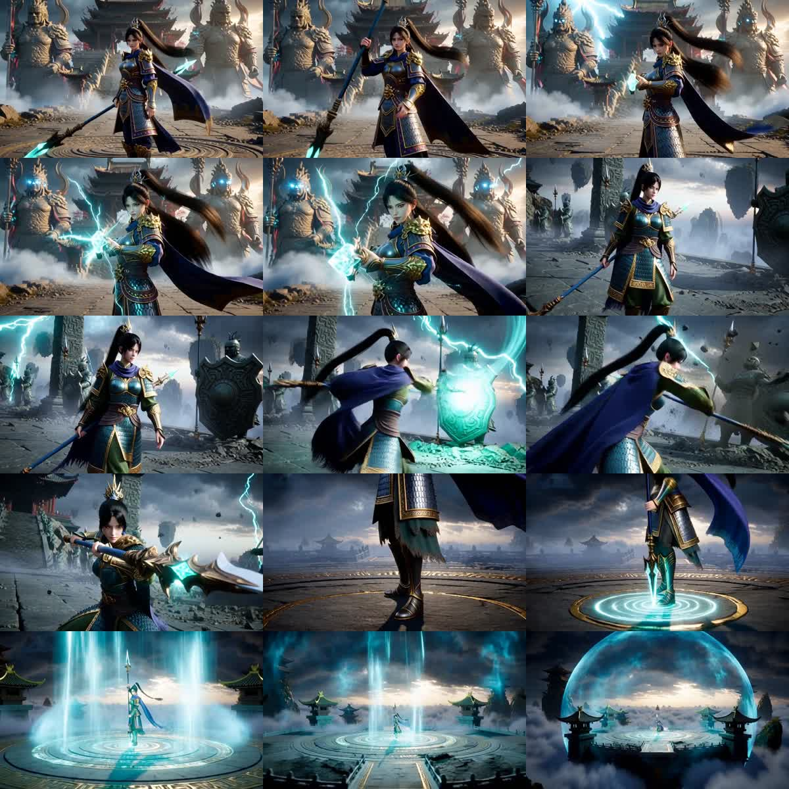
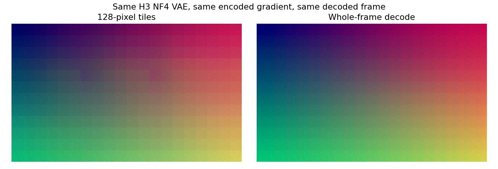

# Parallel Colab research and Lightning experiments — 2026-10-06

## Completed film

[Download the original storm-guardian film](../experiments/lightning/results/storm-guardian-15s.mp4). It contains **360 frames at 800×480 and 24 fps: exactly 15.0 seconds of video**. The AAC container duration is 15.022 seconds due to audio timing. Full-file decoding passes, decoded audio is finite and non-silent, and sampled frames across all three scenes are readable. Character identity and armor details can vary between separately generated scenes; perfect anatomy and prompt adherence are not established.

The selected b25–49 hybrid INT8 H3 checkpoint uses the eight-step LightX2V 768p Turbo adapter at its correct metadata scale **8/128 = 0.0625**. Each 124-frame scene starts at 640×384, lifts to 800×480 before evaluation seven, and uses experimental SelfLift-zero with rho 0.4 and adaptive correction weights 0.5–1.0. FP32 model/VAE arithmetic, guarded FP16 attention, disk offloading and 256-pixel VAE tiles were used. No ComfyUI runtime was used.

| Measurement | Completed film job |
| --- | ---: |
| Whole job, including setup, teardown and assembly | 4410.27 seconds = **73 minutes 30 seconds** |
| Scene 1 / 2 / 3 worker runtime | 1417.08 / 1416.44 / 1417.77 seconds |
| Maximum process-RAM high-water mark | **5.57 GiB** |
| Maximum sampled device memory | **14.54 GiB** |
| Maximum Torch-allocated GPU memory | **10.20 GiB** |
| Maximum recorded Torch-reserved GPU memory | **14.40 GiB** |

Reserved-memory reporting was added after scene 1 started, so it is present for scenes 2 and 3. Device sampling can miss brief peaks. These measurements do not validate a physical 12 GB GPU or native 1080p. There is no matched native 800×480 baseline establishing a SelfLift speed or quality advantage. Render workers have exited; the Studio itself was not reset or stopped.

The key fix was an omitted adapter metadata alpha, which made the earlier eight-step adapter update 16× too strong. Both corrected Turbo-only and corrected SelfLift controls restored readable output before the long job was rerun. The individual scene receipts, memory measurements, final job receipt and media checks are under `experiments/lightning/results/`.

The previous Colab session had expired. A new CPU research session, `h3-research-20261006`, was created; no runtime was reset. Lightning remains the T4 inference machine. Antigravity CLI supplied a read-only code audit while Colab examined pinned source and Lightning ran controlled decoder experiments.

## Colab source analysis

The pinned [H3 VAE implementation](https://github.com/modelscope/DiffSynth-Studio/blob/974cfa37f27ac55eba3b6d10efa21f876900572d/diffsynth/models/minimax_h3_video_vae.py) interprets tile size in pixels. Executing its actual `split_tiles` method on Colab produced:

| Output dimensions | 128-pixel tiles | 256-pixel tiles | Whole-frame tile |
| --- | ---: | ---: | ---: |
| 640×384 | 28 | 6 | 1 |
| 800×480 | 40 | 8 | 1 |

These are tile counts, not speed measurements. Larger tiles require more activation memory.

Colab also inspected byte ranges from the pinned hybrid checkpoint. The timestep table's maximum absolute value is 0.468; the sampled block-25 AdaLN linear weight and bias maxima are 11.49 and 7.33. None of these sampled stored values exceed FP16 range. This does not locate or rule out overflow during the actual forward pass, nor inspect every tensor.

## Lightning controlled decoder comparison

The same NF4 VAE encoded a smooth RGB gradient at 320×192 using a whole-frame tile. The identical resulting latent tensor was decoded with three tile sizes. No diffusion checkpoint, prompt, seed, or denoising step was changed between decodes.

| Decoder tile size | Observed decode time | Reconstruction RMSE |
| --- | ---: | ---: |
| 128 | 5.75 seconds | 0.11269 |
| 256 | 2.00 seconds | 0.11248 |
| 384, whole frame | 1.01 seconds | 0.11342 |

This is a single ordered pass; warm-up and caching can affect timing. It is not a rigorous whole-video speed benchmark. One image latent decoded into four frames; the same first frame was inspected in each case. The 128-pixel reconstruction has visible grid seams, whereas larger-tile reconstructions appear much smoother. Similar RMSE values demonstrate why numerical reconstruction error alone does not establish visual quality.

This implicates small-tile decoding in the synthetic test. It does not prove that tiling accounts for every artifact in generated videos, nor validate the NF4 VAE against unquantized weights.

## Applying the finding

The runner now accepts `--vae-tile-size` and `--save-latents`. A hybrid INT8, FP32, 640×384, 39-frame, four-step trial with 256-pixel VAE tiles completed in **359.10 seconds**, versus **391.93 seconds** for the earlier 128-pixel baseline. The sampled device-memory peak remained **9.41 GiB**. This is approximately **8.4% less wall time** across these two runs; it is not a repeated statistical benchmark.

The inspected generated-video frame no longer shows the earlier large grid artifacts. All other generation settings remained the same except added finite-value checks and latent saving. The 256-pixel setting is now the default; 128 remains available for comparison. SelfLift's pixel-anchor encoder and decoder receive the selected tile size too, but the full longer SelfLift sequence still needs validation with this setting.

Saving generated latents enables subsequent decoder tests without repeating expensive diffusion sampling. `decode_cached.py` completed two tests on the saved real-video latents:

| Tile size | Decode time | Including setup/export | Peak Torch-allocated GPU memory |
| --- | ---: | ---: | ---: |
| 384 | 27.65 seconds | 39.64 seconds | 0.87 GiB |
| 640, whole frame | 25.85 seconds | 37.56 seconds | 1.24 GiB |

Both used zero denoising steps. These are silent decoder comparisons, not new diffusion generation or audio-generation tests. Torch-allocated memory is not total device usage. The whole-frame result does not establish memory requirements for the longer 800×480 story; that job keeps the tested 256-pixel default.

Visual inspection of the cached 640-pixel whole-frame decode showed more grid and triangular artifacts than the 256-pixel generated-video export. Larger tiles are therefore not an automatic quality improvement. The story retains 256-pixel tiles based on the inspected real-video result.

The three-scene hybrid eight-step Turbo + corrected SelfLift story job is running automatically on Lightning. First lower-resolution evaluations took approximately 103 seconds each. Scene export and high-resolution timings remain to be measured. The story assembler now resolves the FFmpeg binary from `imageio_ffmpeg` instead of assuming a system executable is on PATH.

The first hybrid FP32 baseline exported in 391.93 seconds but retained visible grid artifacts. Full-model FP16 was separately tried on the hybrid checkpoint and stopped on non-finite attention values. It is not a validated speed optimization.

## Antigravity audit: hypotheses and corrections

Antigravity suggested the shared NF4 VAE, small decoder tiles, and disk staging as likely contributors. Its stronger claims that these were proven causes and that proposed edits would guarantee resolution were not accepted.

Moving all models into FP32 host RAM would exceed the Studio's approximately 15 GiB host memory. Query/key rescaling can preserve attention algebra only for finite inputs; it cannot recover values that have already overflowed upstream. Replacing the NF4 VAE is a reasonable controlled comparison, not an established fix. No untested attention or all-RAM staging patch was applied.

Raw research/audit files are preserved locally under `/home/ujjwal/h3_research/colab`, `/home/ujjwal/h3_research/vae-diagnostic`, and `/home/ujjwal/h3_research/agy-h3-audit-2026-10-06.txt`. Colab research outputs are under `/content/h3-research-20261006`; Lightning diagnostics are under `output/vae-diagnostic` in the experiment folder.

## First long hybrid SelfLift export: rejected

The 124-frame, 800×480 scene exported successfully in **1417.36 seconds (23.62 minutes)**. Denoising took 19 minutes 43 seconds. Export success and finite tensors did not establish image quality: the inspected middle frame was predominantly colored noise, with no readable guardian. The remaining two scenes were stopped before generation to avoid repeating the failure. The failed clip is preserved locally as `experiments/lightning/results/storm-guardian-scene-1-hybrid-selflift.mp4`; it is not presented as a usable sample.

A short 39-frame hybrid Turbo control using the same guardian prompt and seed was launched without SelfLift. This changes both duration and sampling recipe, so it is a diagnostic control, not a strict one-variable comparison. The earlier clean teapot trial already establishes that this checkpoint/decoder can produce readable output for some prompts. SelfLift on H3 remains unvalidated; finite-value checks alone are insufficient.

The four-step guardian control exported 39 frames at 640×384 in **367.93 seconds**. Its inspected middle frame is readable, showing the guardian, cyan weapon, temple and sentinels. The downloaded 1.625-second H.264/AAC clip passes full FFmpeg decoding. A matched eight-step Turbo control is running before attributing the failure specifically to the SelfLift transition.

## Eight-step adapter metadata bug

The matched eight-step control also exported mostly noise without SelfLift. This rules out SelfLift as the sole explanation for the earlier failure. The queued redundant lift comparison was stopped during setup.

Inspection of the actual pinned Safetensors headers found **rank 128 in both adapters, alpha 128 in the four-step adapter, and alpha 8 in the eight-step adapter**. The pinned DiffSynth loader reads alpha tensor keys but does not apply Safetensors metadata alpha. Our wrapper previously passed its default scale 1, making the eight-step update **16× too strong**. The four-step adapter's intended scale is 1, which explains why its control did not suffer the same loading error.

The runner now reads original adapter metadata and rank before QKV fusion, applies `alpha / rank` through `pipe.load_lora`, and records both values and the scale in each receipt. The eight-step scale is **0.0625**; four-step remains **1.0**. A short 22-frame eight-step control is validating the corrected load before another long render. This is a concrete loading defect; successful visual recovery still requires inspection.

The [official Turbo specifications](https://github.com/ModelTC/Minimax-H3-Turbo#1-model-specs) recommend eight evaluations with video shift 6 and audio shift 3 for the selected 768p eight-step adapter. Those schedule settings were already used. The tested 640×384 canvas is below its 1344×768 training resolution.

The corrected eight-step control exported 22 frames at 640×384 in **572.92 seconds**. The inspected middle frame is readable again, with guardian, weapon, temple and sentinels. The clip passes full FFmpeg decoding. Colab separately verified that applying original-rank scaling before/after QKV fusion preserves the adapter matrix update (maximum absolute error 2.83e-7). This supports the metadata bug diagnosis; a short corrected SelfLift render is now validating the transition itself.

The corrected SelfLift validation exported **22 frames at 800×480 in 648.83 seconds**, after six 640×384 steps, a paired VAE/latent lift and two high-resolution evaluations. Its inspected middle frame is readable and the full file passes FFmpeg decoding. Transition latent standard deviations are approximately 1, with maximum absolute values below 7. This validates a short H3 SelfLift-zero execution, not an improvement over native high-resolution sampling. The original three-scene, 124-frame-per-scene film is now rerunning with the corrected 0.0625 adapter scale.

## Antigravity follow-up after the alpha fix

A second completed read-only performance review is saved at `/home/ujjwal/h3_research/agy-performance-after-alpha-fix.txt`. It proposed expandable CUDA allocator segments, explicit cache release, eager FP32 LoRA conversion, and deleting attention inputs after casting. These are proposals, not measured improvements.

The pinned pipeline already loads LoRA weights with `torch_dtype=self.torch_dtype`, which is FP32 in the working recipe, and stores the scaled hotloaded tensors. Therefore eager FP32 conversion is already present; it is not a new speed fix. Merely deleting local attention references may not free storage retained by the caller. Allocator experiments need separate process launches and measured allocated/reserved/device memory; no allocator change was applied to the active film. New success receipts additionally record peak Torch-reserved GPU memory to support that comparison.

The first corrected long scene exported **124 native frames at 800×480 in 1417.08 seconds**, approximately 5.167 seconds of video. Five sampled frames remain readable and show the guardian raising the spear, cyan energy, moving cape and glowing sentinel eyes. Full FFmpeg decoding and finite, non-silent audio checks pass. The sampled device peak reached **14.54 GiB**, so the long recipe is not validated on a physical 12 GB GPU. Scene 2 started automatically after scene 1 exited.

Scene 2 exported 124 frames at 800×480 in **1416.44 seconds**. Its five sampled frames show a readable spear sweep, cyan energy and shield-bearing sentinels. Full decoding and finite, non-silent audio checks pass. Sampled GPU peak: **13.99 GiB**; Torch allocated/reserved peaks: **10.20/14.40 GiB**. Scene 3 started automatically.
