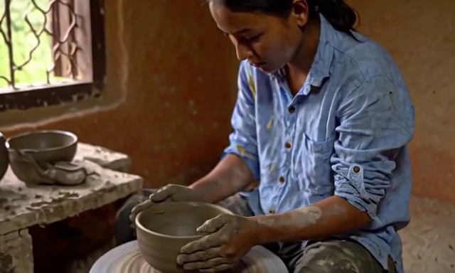
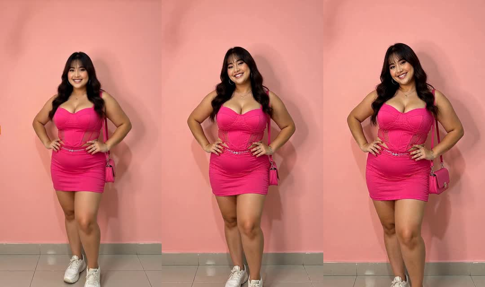

# Video samples

These are real H3 + Turbo LoRA + SelfLift-zero generations from the **earlier direct Comfy PyTorch backend**. They are reference samples, **not outputs of this standalone uv/Diffusers implementation**, which has not completed a full pretrained render.

| Sample | Resolution | Frames | Duration | T4 render time |
|---|---|---|---|---|
| [Ceramic studio](ceramic-studio.mp4) | 640×384 | 39 | 1.625 s | 9m 39s |
| [Rainy tea](rainy-tea.mp4) | 640×384 | 39 | 1.625 s | 9m 39s |
| [Portrait](portrait-1080p.mp4) | 1080×1920 | 56 | 2.333 s | 48m 54s |

All three MP4s were probed and fully decoded again before upload; they include audio. `samples.json` records media properties, backend provenance and render measurements. The portrait was generated at 1088×1920 and center-cropped to 1080×1920 without output resizing; experimental high-resolution tiling was enabled. Some clothing details change over the shot.

## Previews

## GPU memory interpretation

The earlier 640×384 ceramic test observed about 11.71 GiB of device use, sampled every five seconds beginning during sampling. That includes other processes and is not a complete whole-run peak measurement. The 1080p portrait was observed using around 13.6 GiB. Both ran on a T4 with 15360 MiB reported capacity; neither was a test on a 12 GB card. PyTorch allocated-memory receipts exclude the dynamic model-weight cache and must not be presented as total VRAM requirements.
